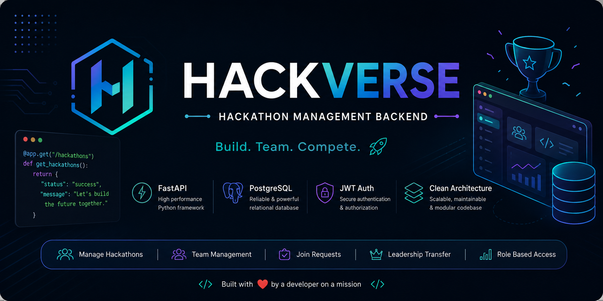

<p align="center">
  
</p>

# 🚀 HackVerse

HackVerse is a full-stack hackathon management platform designed to simplify the entire hackathon lifecycle for organizers and participants.

The platform allows organizers to create hackathons, manage teams, review join requests, and control participant workflows through a secure and scalable backend architecture.

This project is being built with a strong focus on clean architecture, scalability, and production-ready backend development.

---

## ✨ Current Features

- 🔐 JWT Authentication
- 👤 User Profile Management
- 🏆 Hackathon Management
- 👥 Team Management
- 🙋 Team Join Requests
- ✅ Approve / Reject Requests
- 🔒 Role-based Authorization
- 🛠 Service Layer Architecture
- 🗄 PostgreSQL Database
- 🔄 Alembic Migrations

## 📂 Project Structure

```text
HackVerse
│
├── app
│   ├── api
│   │   └── v1
│   │       └── endpoints
│   ├── core
│   ├── crud
│   ├── database
│   ├── models
│   ├── schemas
│   ├── services
│   └── main.py
│
├── alembic
├── .env
├── alembic.ini
├── requirements.txt
└── README.md
```

---

## 🏗 Architecture

The backend follows a layered architecture:

```text
Client
   │
   ▼
API Endpoints
   │
   ▼
Service Layer
   │
   ▼
CRUD Layer
   │
   ▼
PostgreSQL Database
```

### Layer Responsibilities

- **API Layer** → Receives requests and returns responses.
- **Service Layer** → Handles business logic, validation, and workflows.
- **CRUD Layer** → Performs database operations.
- **Database Layer** → Stores application data securely.

---

## 🗄 Database Design

The backend uses a relational database designed to support hackathon workflows while maintaining data integrity.

### Core Entities

- **Users** → Stores participant and organizer information.
- **Hackathons** → Stores hackathon details.
- **Teams** → Represents teams created for hackathons.
- **Team Members** → Maintains team membership.
- **Team Join Requests** → Tracks pending, approved, and rejected join requests.

### Entity Relationship

```text
Users
 │
 ├──────────────┐
 │              │
 ▼              ▼
Teams      Team Join Requests
 │              │
 └──────┬───────┘
        │
        ▼
Team Members

Hackathons
     │
     ▼
Teams
```

### Business Rules

- A user can create multiple teams across different hackathons.
- A team belongs to exactly one hackathon.
- A join request must be approved before a user becomes a team member.
- Duplicate team memberships are prevented at both the application and database levels.
- Only the team leader can approve or reject join requests.

---